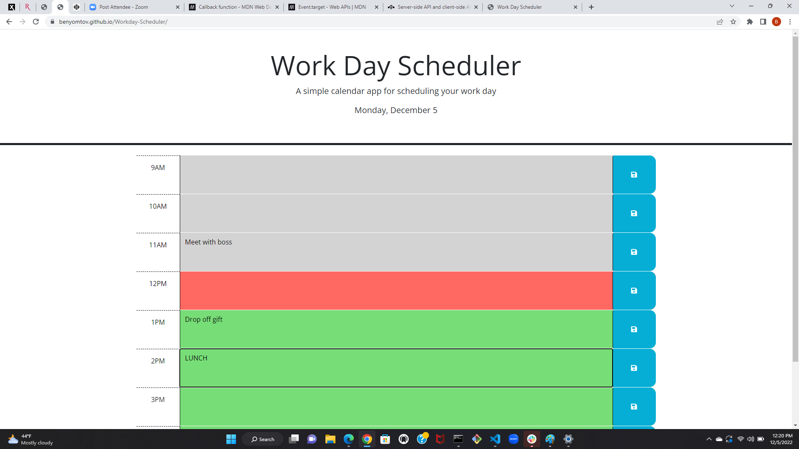
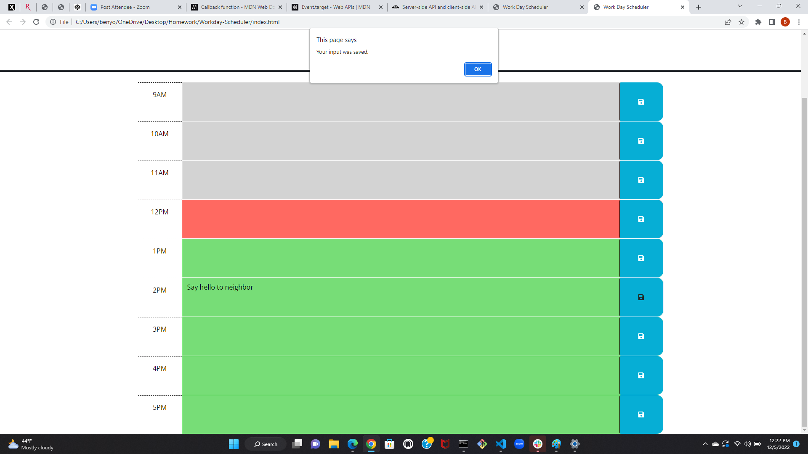

# Workday-Scheduler

## Description

This application is an interactive calendar that can be used to plan daily events. Users can type what they will be doing each hour of the day and save their input so that if they close the page and come back to it later, the saved data will remain on the screen. The hour blocks are color-coded based on whether they are in the past, present, and future so the user can intuitively focus on what currently needs to be done in the current hour and what needs to be done in the future.

## Installation

This application requires no installation and can be accessed on your preferred web browser at https://benyomtov.github.io/Workday-Scheduler/.

## Usage

When the user opens the application, they will see today's day of the week, month, and day of the month displayed at the top of the application. There are nine color-coded text areas labeled by hour where the user can type what they will be doing each hour of the workday. The user can input upcoming events between the hours of 9am and 6pm. The text areas are color-coded based on whether they are in the past, present, and future. After typing in the text area, the user can click the corresponding save button to save the input to local storage. After saving, an alert appears notifying the user that their input has been saved.

## Credits

Created by Rutgers Full Stack Bootcamp, Javascript by Ben Yomtov

Day.JS and JQuery were used to power this application.

These websites were used for research and to learn the code required for this application:

https://www.w3schools.com/

https://day.js.org/docs/en/installation/installation

https://api.jquery.com/

## License

No license.